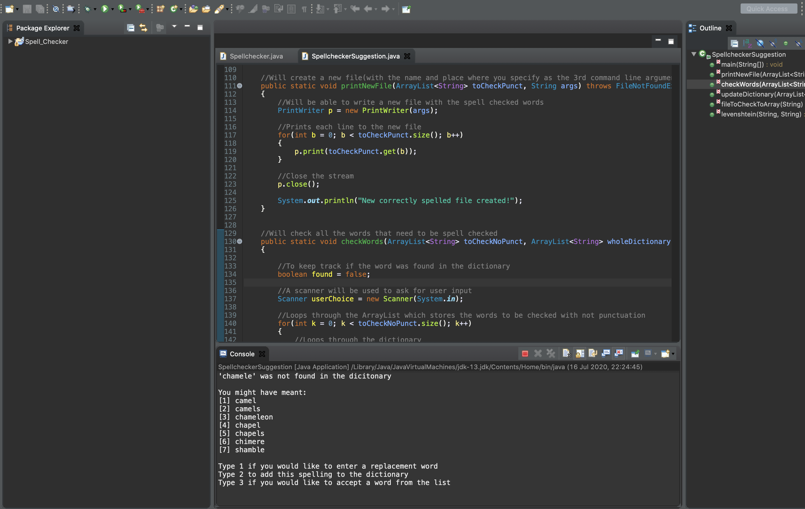

# SpellChecker

# Program
The teask was to create a program that takes a file as a command line argument and it goes through the words checking if any are not in the dictionary. It then offer the user to either enter a replacement or add the word to the dictionary. The correct spell-checked file is stored in a different file (does not overwrite original).

The second task was to use the Levenshtein algorithm, this is to find similar words in the dictionary if a word is not found (e.g. the word brid is not in the dictionary so the algorithms may suggest bird or brick...). Then you can do the same as above or accept a word from the list. 
